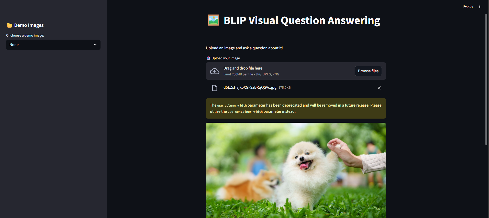
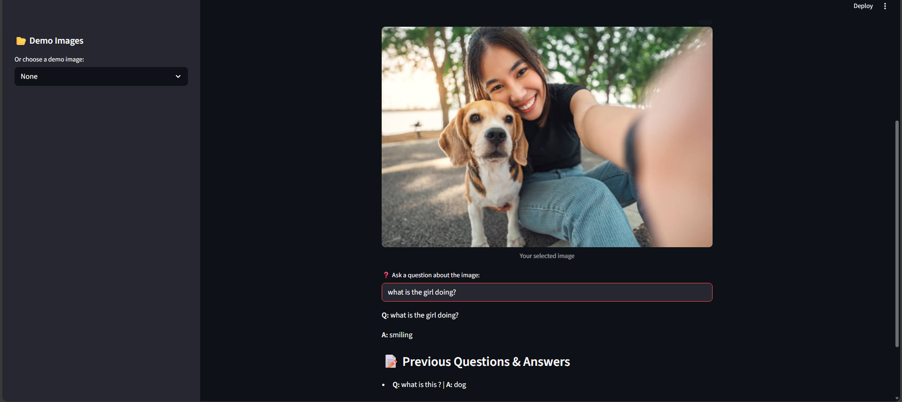

# 🖼️ BLIP Visual Question Answering (VQA) App

A Multimodal AI application that answers natural language questions about images using the BLIP (Bootstrapping Language-Image Pretraining) Transformer model.  
This project integrates Computer Vision and Natural Language Processing to perform intelligent visual reasoning through an interactive Streamlit interface.

---

## 🚀 Project Overview

This project develops a Multimodal Visual Question Answering (VQA) system that allows users to upload an image and ask questions about its content. The system leverages a pretrained BLIP transformer model from Hugging Face to perform cross-modal reasoning between visual and textual inputs.

The application is built using Streamlit for an interactive frontend and PyTorch + Transformers for deep learning inference.

---

## ✨ Key Features

- 🖼️ Upload custom images for analysis  
- ❓ Ask natural language questions about images  
- 🤖 BLIP Transformer-based VQA model  
- 🧠 Multimodal reasoning (Vision + Language)  
- 📊 Session-based Q&A history tracking  
- 🎯 Demo images for quick testing  
- ⚡ Cached model loading for faster performance  

---

## 🏗️ System Architecture

📌 **Architecture Type:** Multimodal Transformer-based VQA System (BLIP)

The application follows a multimodal AI architecture integrating computer vision and natural language processing. The Streamlit frontend collects user inputs (image and question), which are preprocessed using the BLIP processor. The processed inputs are then passed to the BLIP VQA transformer model that performs cross-modal reasoning between visual and textual features. The generated answer is decoded and displayed in the UI along with session-based Q&A history for an interactive user experience.

### 🔷 Architecture Diagram

```

+------------------------+
| User |
| Upload Image + Question|
+-----------+------------+
|
v
+------------------------+
| Streamlit Frontend |
| - Image Upload |
| - Text Input |
| - Sidebar Demo Images |
+-----------+------------+
|
v
+------------------------+
| Input Processing |
| - PIL Image Loading |
| - Question Encoding |
| - BLIP Processor |
+-----------+------------+
|
v
+----------------------------------+
| BLIP VQA Model (Hugging Face) |
| - Vision Encoder |
| - Language Encoder |
| - Cross-Modal Attention |
+-----------+----------------------+
|
v
+------------------------+
| Answer Generation |
| - Text Decoding |
| - Skip Special Tokens |
+-----------+------------+
|
v
+------------------------+
| Output Layer |
| - Display Answer |
| - Session Q&A History |
+------------------------+

```

---

## 🧠 Model Details

- Model: `Salesforce/blip-vqa-large`
- Framework: Hugging Face Transformers
- Backend: PyTorch
- Task: Visual Question Answering (VQA)
- Modality: Vision + Language (Multimodal AI)

The BLIP model uses a transformer-based architecture that jointly processes image features and textual queries to generate context-aware answers.

---

## 🖼️ Demo (Screenshot)

Below is a preview of the BLIP Visual Question Answering application interface:




---

## 📂 Project Structure

```

blip-vqa-app/
│
├── app.py # Main Streamlit application
├── requirements.txt # Project dependencies
├── README.md # Project documentation
├── .gitignore # Ignored files (venv, cache, etc.)
│
└── assets/ # Demo images (optional)

```

---

## ⚙️ Installation & Setup

### 1️⃣ Clone the Repository
```bash
git clone https://github.com/Hana7511/blip-vqa-app.git
cd blip-vqa-app

2️⃣ Create Virtual Environment (Recommended)
python -m venv .venv
source .venv/bin/activate   # Mac/Linux
.venv\Scripts\activate      # Windows

3️⃣ Install Dependencies
pip install -r requirements.txt

---

▶️ How to Run the Application

Run the Streamlit app locally:
streamlit run app.py

Then open in browser:
http://localhost:8501

---

🖥️ Application Workflow

- User uploads an image or selects a demo image
- User enters a natural language question
- Image and question are processed by BLIP Processor
- BLIP Transformer performs multimodal inference
- Generated answer is decoded and displayed
- Previous Q&A history is stored in session state

---

📊 Technologies Used

-Python
-Streamlit
-Hugging Face Transformers
-PyTorch
-PIL (Python Imaging Library)
-BLIP (Vision-Language Model)

---

🔍 Example Use Cases

- Visual AI Assistants
- Accessibility tools for visually impaired users
- Smart image analysis systems
- Educational AI applications
- Multimodal research projects

---

🚀 Future Improvements

- Deploy on Streamlit Cloud / Hugging Face Spaces
- Add GPU optimization
- Support multiple VQA models
- Add image captioning module
- Improve UI/UX design

---

👩‍💻 Author

Hana Al Haris
AI/ML Student | Multimodal AI & Time-Series Projects


